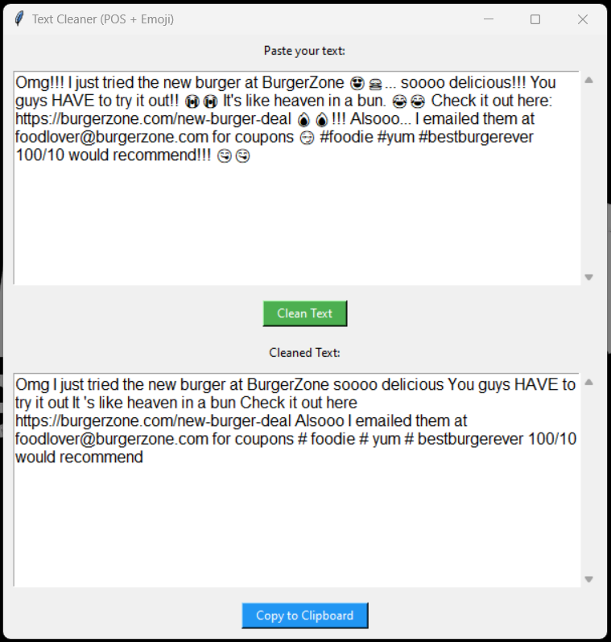

# 🧹 Text Cleaning UI with NLP (POS & Emoji Removal)

This project is a beginner-friendly tool for cleaning raw text data using **POS tagging** and **emoji removal** techniques. It includes:

- ✅ A user-friendly **web UI** for quick cleaning
- 🧠 A **Jupyter notebook** to understand the backend logic using `spaCy` and `emoji`
- 📚 Perfect for NLP students, data scientists, and developers who want to learn how text preprocessing works

---

## 📸 Demo



## 🚀 Features

- Paste any messy text into the UI
- Removes:
  - Emojis 😊🔥🍔
  - Unwanted Part-of-Speech (POS) tags (customizable!)
- Cleaned text output is instantly displayed
- Backend logic is fully explained in the notebook

## 📁 Project Structure

```bash
.
├── textcleaner_UI.py                 # Streamlit or Flask UI code
├── text_analize.ipynb # Jupyter Notebook for backend understanding
└── README.md              # This file
```

🧠 Learning Objectives
<li>Understand emoji removal techniques</li>
<li>Learn how POS tagging works in spaCy</li>
<li>Practice custom filtering with Penn Treebank tag sets</li>
<li>Build basic data-cleaning tools with Python</li>
---

## ⚠️ Limitations

While this tool provides a solid foundation for learning and basic text cleaning, there are a few limitations to keep in mind:
### 🧱 POS Tag Simplicity
- The POS filtering is rule-based and may **remove useful words** if tag sets are not chosen carefully.
- It does **not handle multi-word expressions** (e.g., "New York") intelligently.
### 😀 Emoji Handling
- Emoji detection uses character matching and might **miss complex or newer emojis**.
- Emojis with skin tones or modifiers may not be completely removed.
### 🌐 Language Scope
- Currently supports **only English** (via `en_core_web_sm` in spaCy).
- Does not support multilingual tokenization or tagging.
### 📉 Text Quality
- It **does not fix grammar**, correct typos, or improve readability beyond filtering.
- Removing POS or emojis may **affect sentence meaning** or structure.
### 🧪 Not Production-Ready
- Designed for **educational use** and **small-scale cleaning**.
- Not optimized for large datasets or advanced NLP pipelines.

---


